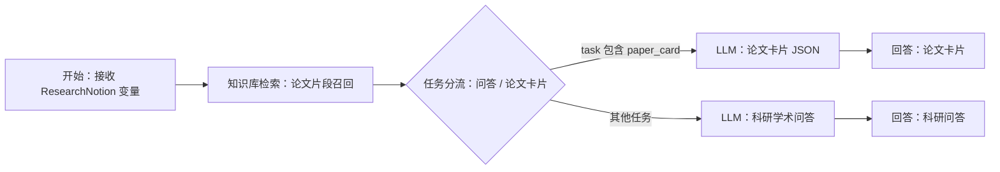

# Dify Workflow 搭建说明

本项目的“科研学术问答智能体”可以在 Dify 中用 Advanced Chat Workflow 搭建。ResearchNotion 桌面软件负责论文管理、文件上传、阅读器和调用 API；智能体的任务编排、知识检索、分支判断和大模型回答放在 Dify Workflow 中，方便课程展示。

## 节点结构



## 开始节点变量

| 变量名 | 类型 | 是否必填 | 用途 |
| --- | --- | --- | --- |
| `task` | text-input | 否 | `research_chat` 或 `paper_card`。 |
| `contextType` | text-input | 否 | `free`、`folder` 或 `paper`。 |
| `contextLabel` | text-input | 否 | 当前论文库名或论文标题。 |
| `folderId` | text-input | 否 | ResearchNotion 本地论文库 ID。 |
| `paperId` | text-input | 否 | ResearchNotion 本地论文 ID。 |
| `emphasisContext` | paragraph | 否 | 用户在阅读器里选中的强调上下文。 |

用户真实问题走 Dify 的 `sys.query`，不需要额外建 `query` 变量。

## 知识库检索节点

节点名称：`知识库检索：论文片段召回`

配置：

- 选择 ResearchNotion 使用的论文知识库 dataset。
- 查询变量选择 `sys.query`。
- 检索模式可以先用 `single`。

本地演示环境里已经创建了一个 dataset：`ResearchNotion Demo Library`。如果后续重新搭建，先在 Dify 知识库页面创建论文库，再把它绑定到这个节点。

项目也提供了自动初始化脚本：

```powershell
pnpm provision:dify
```

这个脚本会直接在本地 Dify 中创建或更新 `ResearchNotion Academic QA Agent`，并把 ResearchNotion 本地设置指向该 App。课程展示时仍然可以打开 Dify 控制台查看节点和连线。

## 条件分支节点

节点名称：`任务分流：问答 / 论文卡片`

条件：

- 变量：开始节点的 `task`
- 运算：contains
- 值：`paper_card`

命中时进入“论文卡片 JSON”节点；未命中时进入“科研学术问答”节点。

## 科研问答 LLM 节点

节点名称：`LLM：科研学术问答`

开启 Context，并选择知识库检索节点的 `result`。

系统提示词：

```text
你是 ResearchNotion 科研学术问答智能体。优先依据知识库检索结果、当前论文、用户选中的强调上下文回答。资料不足时明确说“不知道”或“当前资料不足”，不要编造论文、作者、年份、实验数据或结论。回答要结构清晰，适合科研阅读和小组汇报。不要输出 <think> 或隐藏推理过程。

当前上下文：{{#开始节点.contextLabel#}}
上下文类型：{{#开始节点.contextType#}}
强调上下文：{{#开始节点.emphasisContext#}}
```

用户提示词：

```text
用户问题：{{#sys.query#}}

检索结果：
{{#知识库检索节点.result#}}
```

## 论文卡片 LLM 节点

节点名称：`LLM：论文卡片 JSON`

开启 Context，并选择知识库检索节点的 `result`。

系统提示词：

```text
你是 ResearchNotion 论文卡片生成节点。请只返回 JSON，不要返回 Markdown 代码块或额外解释。字段必须包括 authors, year, oneSentenceSummary, researchProblem, methodSummary, contributions, keywords。contributions 和 keywords 必须是字符串数组。证据不足时使用空字符串或空数组，不要编造。不要输出 <think> 或隐藏推理过程。

当前论文/上下文：{{#开始节点.contextLabel#}}
```

用户提示词：

```text
请根据知识库检索结果和用户问题生成论文卡片。

检索结果：
{{#知识库检索节点.result#}}

用户问题：{{#sys.query#}}
```

## ResearchNotion 调用方式

ResearchNotion 调用 Dify `/v1/chat-messages`：

- `query` 传用户问题或论文卡片生成任务。
- `inputs` 传开始节点变量。
- `response_mode` 使用 `blocking`。
- Dify 返回的 `metadata.retriever_resources` 会被 ResearchNotion 保存为引用来源。

这意味着课程展示时可以这样描述：

> 我在 Dify 中用 Workflow 搭建了科研学术问答智能体，包含开始变量、知识库检索、任务分流、科研问答、论文卡片生成和回答输出节点；桌面端 ResearchNotion 负责论文管理和调用这个 Dify 智能体。

## Agent 工具版搭建

如果要把它升级成更像“真正智能体”的形态，可以在 Dify 中创建 Agent App，或在支持工具调用的工作流里加入 Agent 节点。这个版本的关键不是把知识库检索固定成流程第一步，而是把 ResearchNotion 桌面端提供的阅读能力作为工具交给 Agent 自己选择。

ResearchNotion 桌面端启动后会开放 OpenAPI：

- 宿主机/浏览器查看：`http://127.0.0.1:17777/openapi.json`
- Dify Docker 导入：`http://host.docker.internal:17777/openapi.json?server=http%3A%2F%2Fhost.docker.internal%3A17777`

建议导入并启用这些工具：

- `get_current_context`：读取当前论文库、当前论文、页码和选中文本。
- `get_current_page_text`：读取当前打开论文的当前页文本。
- `get_paper_metadata`：读取论文标题、路径、类型、索引状态和论文卡片。
- `get_paper_page_text`：读取指定论文的指定页文本。
- `get_paper_section`：按章节标题或编号读取论文片段。
- `get_paper_outline`：读取论文大纲、章节标题，或在 PDF 没有可识别标题时回退为页级结构。
- `get_paper_text_chunk`：按文本块逐步读取论文全文，适合整篇论文总结和跨章节问题。
- `list_library_papers`：列出当前或指定论文库里的论文。
- `search_current_paper`：在当前论文内搜索相关片段。
- `search_library`：在当前或指定论文库内搜索相关片段。

Agent 系统提示词建议明确写入：

```text
你可以调用 ResearchNotion 本地工具，不要只依赖一次知识库召回。
用户问“这部分”“当前页”“这一节”“选中内容”时，先调用 get_current_context。
如果有 selectedText，优先依据 selectedText；否则调用 get_current_page_text 或 get_paper_section。
用户问整篇当前论文或提出宽泛事实问题时，先调用 get_current_context 和 investigate_paper；明确页码、章节或结构时，再使用 get_paper_section、get_paper_page_text、get_paper_outline、get_paper_text_chunk 或 search_current_paper。
用户问当前论文库或多篇论文时，先调用 list_library_papers，再调用 search_library。
中文问题检索英文论文时，先把问题改写成 English query，再调用 search_current_paper 或 search_library。
最终回答尽量说明依据来自哪篇 paper、哪一 page、哪一 section；工具结果不足时继续改写查询或读取更确定的章节，不要编造。
```

当前 `pnpm provision:dify` 仍然自动创建旧的 Advanced Chat Workflow，方便快速演示和写入 API Key；Agent 工具版现在可以用脚本自动创建一个独立的旧 Agent Chat 应用，让 Dify 运行器以函数调用方式自主选择 ResearchNotion 本地工具。

先导入工具提供者，再创建工具调用型 Agent：

```powershell
pnpm import:dify-tools
pnpm provision:dify-agent
```

`pnpm import:dify-tools` 会调用 Dify 容器内的 `ApiToolManageService`，创建或更新 `ResearchNotion_Local_Tools`，并把上述 11 个 OpenAPI 操作导入为 Dify 自定义 API 工具。`pnpm provision:dify-agent` 会创建或更新 `ResearchNotion Tool Agent`，把这些工具写入 `agent_mode.tools`，并验证 Dify 能为每个工具构建 Agent 运行时。

Dify 1.15 的新版 Agent App / Agent V2 工具层更偏向 Plugin Tool；ResearchNotion 当前的 OpenAPI 自定义工具在旧 `agent-chat` 运行器里有明确支持路径。因此现阶段自动化选择旧 Agent Chat，后续如果要追求更漂亮的新版 Agent App 画布展示，可以把本地工具进一步封装成 Dify Plugin 或继续适配 Agent V2。
